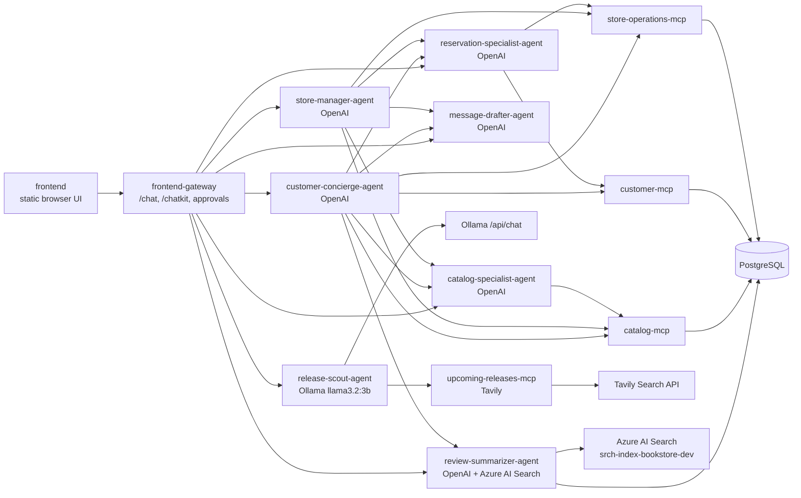

# Local Bookstore Assistant

This repository implements a demo multi-agent bookstore assistant:

- Seven independently callable agents
- Four FastMCP servers
- PostgreSQL demo data
- Human approval before write actions
- A2A-style streaming endpoints for agent calls
- OpenAI-backed bookstore agents plus an Ollama-backed Release Scout agent
- Tavily-backed internet search for upcoming book releases
- Azure AI Search-backed review retrieval for book review summaries
- ChatKit-oriented frontend gateway and dockerized browser frontend

Useful supporting docs:

- `docs/bookstore-agent-scenario.md`
- `frontend/README.md`
- `COMMANDS.md`

## Quick Start

```bash
# Create local config and install dependencies
cp .env.example .env
uv sync
uv lock

# Start the lighter runtime stack
make stack-runtime

# Reset demo data once Postgres is healthy
make reset-db

# Or start everything, including Grafana, Tempo, OTel Collector, and Langfuse
make stack-full
```

The runtime stack starts the OpenAI-backed bookstore agents, Release Scout,
Ollama, all MCP servers, database, gateway, and frontend. The full stack adds
local observability with the OpenTelemetry Collector, Tempo, Grafana, and
Langfuse.

If your machine already has Postgres on `5432`, set another host port in `.env`,
for example `POSTGRES_PORT=15432`. The containers still talk to Postgres on
`postgres:5432` internally.

For other host port conflicts, use the `*_HOST_PORT` variables in `.env`. Keep
the non-host `*_PORT` values unchanged unless you also want to change the port
that the service listens on inside its container.

Open the frontend at:

```text
http://localhost:3000
```

The frontend gateway is available at:

```text
http://localhost:8300
```

## Local Llama 3.2 3B With Ollama

Docker Compose includes a CPU-only Ollama service for local `llama3.2:3b` runs.
No GPU flags are required. Ollama configuration uses
`OLLAMA_*` variables so it can run alongside the OpenAI configuration in
`OPENAI_*`.

Start the runtime stack. On first run, Compose starts Ollama, pulls the
configured model, and then starts Release Scout:

```bash
make stack-runtime

# Call Ollama directly after the model is pulled
curl http://localhost:11434/api/chat \
  -H 'Content-Type: application/json' \
  -d '{
    "model": "llama3.2:3b",
    "messages": [{"role": "user", "content": "Hello from the bookstore stack"}],
    "stream": false
  }'
```

Configure OpenAI, Ollama, and Tavily independently in `.env`:

```env
OPENAI_MODEL=gpt-5.5
OPENAI_API_KEY=...

OLLAMA_MODEL=llama3.2:3b
OLLAMA_BASE_URL=http://ollama:11434
OLLAMA_API_KEY=ollama
OLLAMA_TIMEOUT_SECONDS=300
A2A_STREAM_TIMEOUT_SECONDS=300

TAVILY_API_KEY=tvly-...
```

After updating `.env`, rerun the start command above.

Open `http://localhost:3000` and choose `Release Scout` in the agent list
to search for upcoming book releases. Existing agents continue to use the
OpenAI settings.

Ollama stores downloaded models in the `ollama` named volume. If host port
`11434` is already occupied, set `OLLAMA_HOST_PORT` in `.env`.
CPU inference can be slow on first prompt/model load; `OLLAMA_TIMEOUT_SECONDS`
and `A2A_STREAM_TIMEOUT_SECONDS` keep Release Scout from surfacing that delay as
a network failure.

## Azure AI Search Book Reviews

Review Summarizer uses synthetic reviews generated from the Postgres catalog,
stored locally as JSONL, and uploaded unchunked to Azure AI Search. Configure
the search service in `.env`:

```env
AZURE_AI_SEARCH_ENDPOINT=https://<search-service>.search.windows.net
AZURE_AI_SEARCH_INDEX_NAME=srch-index-bookstore-dev
AZURE_AI_SEARCH_ADMIN_KEY=...
AZURE_AI_SEARCH_QUERY_KEY=
BOOK_REVIEW_SEARCH_TOP_K=15
```

Generate and upload the review corpus after Postgres has been seeded:

```bash
docker compose run --rm bookstore-cli bookstore-ai-search rebuild
```

The generated JSONL file defaults to `data/book_reviews/book_reviews.jsonl` and
is ignored by Git. Open the frontend and choose `Review Summarizer`, or ask
Customer Concierge a review question such as "What do people like and dislike
about The Lantern Cipher?"

## Services

| Service | Default host port | Purpose |
|---|---:|---|
| `ollama` | 11434 | CPU-only local LLM runtime for `llama3.2:3b` |
| `catalog-mcp` | 8101 | Book search and recommendations |
| `customer-mcp` | 8102 | Customer profiles and preferences |
| `store-operations-mcp` | 8103 | Inventory, reservations, and sales |
| `upcoming-releases-mcp` | 8104 | Tavily-backed web search for upcoming releases |
| `customer-concierge-agent` | 8201 | Customer-facing master agent |
| `store-manager-agent` | 8202 | Staff-facing master agent |
| `catalog-specialist-agent` | 8203 | Catalog subagent |
| `reservation-specialist-agent` | 8204 | Reservation subagent |
| `message-drafter-agent` | 8205 | No-tool drafting subagent |
| `release-scout-agent` | 8206 | Ollama-backed upcoming release subagent |
| `review-summarizer-agent` | 8207 | Azure AI Search-backed review summarization subagent |
| `frontend-gateway` | 8300 | ChatKit gateway and approval routes |
| `frontend` | 3000 | Browser UI |
| `tempo` | 3200 | Full-stack trace store queried by Grafana |
| `grafana` | 3001 | Full-stack trace UI with a pre-provisioned Tempo datasource |
| `otel-collector` | 14318 / 14317 | Full-stack OTLP HTTP / gRPC intake for traces |
| `langfuse-web` | 3002 | Full-stack local Langfuse UI |

The host port can be changed with the matching `*_HOST_PORT` variable while the
service keeps its internal container port. For example,
`CATALOG_MCP_HOST_PORT=18101` publishes the Catalog MCP server on host port
`18101` while other containers still reach it at `catalog-mcp:8101`.

## HTTP Surfaces

All Python HTTP services expose `GET /healthz` and `GET /readyz`.

- MCP servers mount FastMCP at `/mcp`.
- Agent servers expose `GET /.well-known/agent-card.json`,
  `GET /.well-known/agent.json`, `POST /a2a`, `POST /a2a/stream`, and
  `POST /v1/chat/completions`.
- The frontend gateway exposes `GET /agents`, `POST /chat`, `POST /chatkit`,
  `GET /approvals`, `GET /approvals/{approval_id}`,
  `POST /approvals/{approval_id}/approve`, and
  `POST /approvals/{approval_id}/reject`.

## Architecture



## Data Model

The demo schema is initialized by `scripts/init_db.py` and seeded by
`scripts/seed_fake_data.py`.

| Table | Purpose |
|---|---|
| `authors`, `books`, `book_authors` | Catalog metadata, genre, audience, price, popularity, and author links. |
| `inventory` | Current on-hand and reserved quantities plus shelf location for each book. |
| `customers`, `customer_preferences` | Customer profile, loyalty tier, and reading preferences. |
| `approvals` | Pending, approved, and rejected write proposals emitted by agents. |
| `reservations` | Reservation status and pickup date, with approved writes linked to `approvals.approval_id`. |
| `sales` | Quantity, customer, price, and date records used by store-operation summaries. |

## Container Images

The backend services use one reusable Python Dockerfile. Each agent and MCP
server is built with a service-specific `BOOKSTORE_SERVICE_MODULE` so it can be
tagged, pushed, and deployed independently:

```bash
make docker-build-agent-mcp-images
```

Set `BACKEND_IMAGE_PREFIX` and `IMAGE_TAG` when building images for a registry:

```bash
make docker-build-agent-mcp-images \
  BACKEND_IMAGE_PREFIX=ghcr.io/your-org/bookstore \
  IMAGE_TAG=0.1.0
```

`docker compose build` uses the same image names and also builds the gateway and
frontend images for local full-stack runs.

## Kubernetes

The current full Kubernetes deployment lives in `k8s/kaos`. It uses KAOS custom
resources for `ModelAPI`, `MCPServer`, and `Agent` workloads, including:

- `ModelAPI/openai` for the existing OpenAI-backed agents
- `ModelAPI/llama3-2-3b` for the hosted Ollama `llama3.2:3b` runtime
- `MCPServer/upcoming-releases` for Tavily-backed internet search
- `Agent/release-scout` for upcoming book-release scouting

Build all images, including the frontend image that contains agent-specific
prompt recommendations and local chat history:

```bash
make docker-build-all-images
```

`k8s/kaos/secrets.yaml` intentionally contains placeholders. For a local KAOS
cluster, put `OPENAI_API_KEY` and `TAVILY_API_KEY` in `.LOCAL_KEYS`, then apply
the real secret with:

```bash
bash deploy-secret.sh
```

From the repository root, `deploy-resources.sh` applies the KAOS components in
dependency order and calls `deploy-secret.sh` for the real secret:

```bash
bash deploy-resources.sh
```

Apply the rest of the KAOS stack without overwriting the real secret:

```bash
kubectl kustomize k8s/kaos \
  | yq 'select(.kind != "Secret" or .metadata.name != "bookstore-secrets")' \
  | kubectl apply -f -
```

Useful checks:

```bash
kubectl -n bookstore get modelapi,mcpserver,agent
kubectl -n bookstore get pods,svc
kubectl -n bookstore port-forward svc/frontend-gateway 8300:8300
kubectl -n bookstore port-forward svc/frontend 3000:80
```

Restart every Deployment in the `bookstore` namespace after pushing fresh
images:

```bash
kubectl rollout restart deployment -n bookstore
kubectl rollout status deployment -n bookstore
```

The restart recreates Pods, but image re-pulls still follow each container's
`imagePullPolicy`; use `Always` or a new immutable image tag when you need to
guarantee a fresh image.

For clusters without KAOS CRDs, `k8s/base` provides plain Kubernetes manifests
for the backend, MCP servers, agents, gateway, Postgres, Ollama, the model-pull
Job, Upcoming Releases MCP server, and Release Scout agent. It does not include
a plain Kubernetes browser frontend manifest; use the KAOS overlay or Docker
Compose when you need the browser UI.

Review Summarizer is currently wired for local Docker Compose and direct local
service runs. Kubernetes manifests for that agent and the Azure AI Search review
configuration are intentionally deferred. If you deploy the latest frontend
image to Kubernetes before adding those manifests, the Review Summarizer option
can appear in the UI but will not have a backing Kubernetes agent service.

## Observability

Observability is disabled in the lighter runtime stack and enabled by the full
stack overlay:

```env
OBSERVABILITY_ENABLED=false
OBSERVABILITY_CAPTURE_CONTENT=true
OBSERVABILITY_CONTENT_MAX_CHARS=6000
OTEL_EXPORTER_OTLP_TRACES_ENDPOINT=http://otel-collector:4318/v1/traces
OTEL_RESOURCE_ATTRIBUTES=deployment.environment=demo,service.namespace=bookstore-agents
```

Run `make stack-full` to start the runtime services plus the OpenTelemetry
Collector, Tempo, Grafana, and local OSS Langfuse. The collector fans out traces
to both Tempo and Langfuse. In Kubernetes, the observability stack runs in the
`monitoring` namespace and the app exports traces to
`otel-collector.monitoring.svc.cluster.local`. See `COMMANDS.md#observability`
for the grouped local startup commands, health checks, smoke trace commands,
URLs, and the full Kubernetes apply order, including the Langfuse auth secret
step after applying the observability overlay.

The full Compose overlay is `docker-compose.observability.yml`. It adds
`tempo`, `grafana`, `otel-collector`, `langfuse-web`, `langfuse-worker`,
`langfuse-postgres`, `langfuse-clickhouse`, `langfuse-redis`, and
`langfuse-minio`. MinIO exposes its S3-compatible API on host port `9090` and
its console on `9091`.

## Browser UI

The frontend has a left-pane agent list for the seven built-in gateway agent
keys and sends messages through the `frontend-gateway`. In the runtime stack,
Release Scout is selectable and backed by Ollama; Review Summarizer is
selectable and backed by Azure AI Search.
The active run timeline appears inline below each user message, so longer
conversations scroll inside the conversation pane instead of creating a second
page-level timeline.

Recent chats are stored in browser `localStorage` without adding backend routes,
database tables, or infrastructure. Selecting another agent starts a fresh chat
when the current one already has messages, or switches the empty draft chat to
that agent. Prompt recommendations above the composer change with the selected
agent.

Pending write approvals appear in the sidebar. Approving or rejecting a card
calls the gateway approval route and refreshes the pending approval list.

## Write And Approval Flow

Mutating MCP tools do not write immediately during normal agent runs. The agent
creates a pending approval and returns an `approval_required` event instead.

Approval-gated tools:

- `create_reservation`
- `cancel_reservation`
- `mark_reservation_picked_up`
- `adjust_inventory`
- `update_customer_preferences`

When an approval is accepted, `frontend-gateway` executes the underlying write
tool and stores the `approval_id` with the database update. If the approval is
rejected, no database mutation is performed.

Today's pickup queue only returns active reservations. After a cancellation or
pickup completion is approved, that reservation no longer appears in the
pickup queue.

## Notes

The first implementation provides A2A-compatible HTTP/JSON streaming surfaces
and an SDK-ready structure. The agent runtime has deterministic fallbacks so the
stack can be exercised without an OpenAI key. OpenAI and Ollama settings are
kept separate as `OPENAI_*` and `OLLAMA_*` variables so both providers can be
configured for the same application run.
