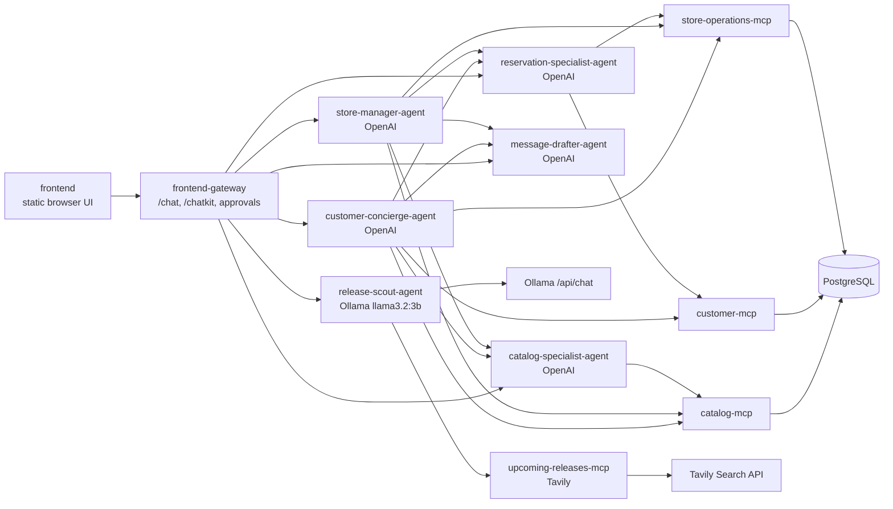

# Local Bookstore Assistant

This repository implements a demo multi-agent bookstore assistant:

- Six independently callable agents
- Four FastMCP servers
- PostgreSQL demo data
- Human approval before write actions
- A2A-style streaming endpoints for agent calls
- OpenAI-backed bookstore agents plus an Ollama-backed Release Scout agent
- Tavily-backed internet search for upcoming book releases
- ChatKit-oriented frontend gateway and dockerized browser frontend

Useful supporting docs:

- `docs/bookstore-agent-scenario.md`
- `frontend/README.md`
- `COMMANDS.md`

## Quick Start

```bash
cp .env.example .env
uv sync
uv lock
docker compose build
docker compose up -d postgres
docker compose run --rm bookstore-cli python -m scripts.reset_demo_data
docker compose up
```

The default Compose stack starts the OpenAI-backed bookstore agents, MCP
servers, database, gateway, frontend, and local trace observability with the
OpenTelemetry Collector, Tempo, and Grafana. Release Scout, Ollama, and the
upcoming releases MCP server are in the optional `local-llm` profile described
below.

If your machine already has Postgres on `5432`, set another host port in `.env`,
for example `POSTGRES_PORT=15432`. The containers still talk to Postgres on
`postgres:5432` internally.

For other host port conflicts, use the `*_HOST_PORT` variables in `.env`. Keep
the non-host `*_PORT` values unchanged unless you also want to change the port
that the service listens on inside its container.

Open the frontend at:

```text
http://localhost:3000
```

The frontend gateway is available at:

```text
http://localhost:8300
```

## Local Llama 3.2 3B With Ollama

Docker Compose includes an optional CPU-only Ollama service for local
`llama3.2:3b` runs. No GPU flags are required. Ollama configuration uses
`OLLAMA_*` variables so it can run alongside the OpenAI configuration in
`OPENAI_*`.

Start the local LLM stack. On first run, Compose starts Ollama, pulls the
configured model, and then starts Release Scout:

```bash
docker compose --profile local-llm up --build
```

Call it locally:

```bash
curl http://localhost:11434/api/chat \
  -H 'Content-Type: application/json' \
  -d '{
    "model": "llama3.2:3b",
    "messages": [{"role": "user", "content": "Hello from the bookstore stack"}],
    "stream": false
  }'
```

Configure OpenAI and Ollama independently in `.env`:

```env
OPENAI_MODEL=gpt-5.5
OPENAI_API_KEY=...

OLLAMA_MODEL=llama3.2:3b
OLLAMA_BASE_URL=http://ollama:11434
OLLAMA_API_KEY=ollama

TAVILY_API_KEY=tvly-...
```

After updating `.env`, start the stack with the same command:

```bash
docker compose --profile local-llm up --build
```

Open `http://localhost:3000` and choose `Release Scout` in the agent selector
to search for upcoming book releases. Existing agents continue to use the
OpenAI settings.

Ollama stores downloaded models in the `ollama` named volume. If host port
`11434` is already occupied, set `OLLAMA_HOST_PORT` in `.env`.

## Services

| Service | Default host port | Purpose |
|---|---:|---|
| `ollama` | 11434 | Optional CPU-only local LLM runtime for `llama3.2:3b` |
| `catalog-mcp` | 8101 | Book search and recommendations |
| `customer-mcp` | 8102 | Customer profiles and preferences |
| `store-operations-mcp` | 8103 | Inventory, reservations, and sales |
| `upcoming-releases-mcp` | 8104 | Tavily-backed web search for upcoming releases |
| `customer-concierge-agent` | 8201 | Customer-facing master agent |
| `store-manager-agent` | 8202 | Staff-facing master agent |
| `catalog-specialist-agent` | 8203 | Catalog subagent |
| `reservation-specialist-agent` | 8204 | Reservation subagent |
| `message-drafter-agent` | 8205 | No-tool drafting subagent |
| `release-scout-agent` | 8206 | Ollama-backed upcoming release subagent |
| `frontend-gateway` | 8300 | ChatKit gateway and approval routes |
| `frontend` | 3000 | Browser UI |
| `tempo` | 3200 | Local trace store queried by Grafana |
| `grafana` | 3001 | Local trace UI with a pre-provisioned Tempo datasource |
| `otel-collector` | 14318 / 14317 | Local OTLP HTTP / gRPC intake for traces |

The host port can be changed with the matching `*_HOST_PORT` variable while the
service keeps its internal container port. For example,
`CATALOG_MCP_HOST_PORT=18101` publishes the Catalog MCP server on host port
`18101` while other containers still reach it at `catalog-mcp:8101`.

## Architecture



## Container Images

The backend services use one reusable Python Dockerfile. Each agent and MCP
server is built with a service-specific `BOOKSTORE_SERVICE_MODULE` so it can be
tagged, pushed, and deployed independently:

```bash
make docker-build-agent-mcp-images
```

Set `BACKEND_IMAGE_PREFIX` and `IMAGE_TAG` when building images for a registry:

```bash
make docker-build-agent-mcp-images \
  BACKEND_IMAGE_PREFIX=ghcr.io/your-org/bookstore \
  IMAGE_TAG=0.1.0
```

`docker compose build` uses the same image names and also builds the gateway and
frontend images for local full-stack runs.

## Kubernetes

The current full Kubernetes deployment lives in `k8s/kaos`. It uses KAOS custom
resources for `ModelAPI`, `MCPServer`, and `Agent` workloads, including:

- `ModelAPI/openai` for the existing OpenAI-backed agents
- `ModelAPI/llama3-2-3b` for the hosted Ollama `llama3.2:3b` runtime
- `MCPServer/upcoming-releases` for Tavily-backed internet search
- `Agent/release-scout` for upcoming book-release scouting

Build all images, including the frontend image that contains the Release Scout
selector and starter prompt:

```bash
make docker-build-all-images
```

`k8s/kaos/secrets.yaml` intentionally contains placeholders. For a local KAOS
cluster, put `OPENAI_API_KEY` and `TAVILY_API_KEY` in `.LOCAL_KEYS`, then apply
the real secret with:

```bash
bash deploy-secret.sh
```

Apply the rest of the KAOS stack without overwriting the real secret:

```bash
kubectl kustomize k8s/kaos \
  | yq 'select(.kind != "Secret" or .metadata.name != "bookstore-secrets")' \
  | kubectl apply -f -
```

Useful checks:

```bash
kubectl -n bookstore get modelapi,mcpserver,agent
kubectl -n bookstore get pods,svc
kubectl -n bookstore port-forward svc/frontend-gateway 8300:8300
kubectl -n bookstore port-forward svc/frontend 3000:80
```

For clusters without KAOS CRDs, `k8s/base` provides plain Kubernetes
Deployment/Service manifests. It keeps OpenAI external through
`OPENAI_API_KEY`, and includes an in-cluster Ollama runtime, model-pull Job,
Upcoming Releases MCP server, and Release Scout agent.

## Observability

Observability is enabled by default and is OTel-first:

```env
OBSERVABILITY_ENABLED=true
OBSERVABILITY_CAPTURE_CONTENT=true
OBSERVABILITY_CONTENT_MAX_CHARS=6000
OTEL_EXPORTER_OTLP_TRACES_ENDPOINT=http://otel-collector:4318/v1/traces
OTEL_RESOURCE_ATTRIBUTES=deployment.environment=demo,service.namespace=bookstore-agents
```

The default Docker Compose collector exports traces to Tempo, and Grafana is
available at `http://localhost:3001`. Add `docker-compose.langfuse.yml` to run
the fully local OSS Langfuse path; the collector then fans out traces to both
Tempo and Langfuse. In Kubernetes, the observability stack runs in the
`monitoring` namespace and the app exports traces to
`otel-collector.monitoring.svc.cluster.local`. See `COMMANDS.md#observability`
for the grouped local startup commands, health checks, smoke trace commands,
URLs, and the full Kubernetes apply order, including the Langfuse auth secret
step after applying the observability overlay.

## Browser UI

The frontend lets you select any of the six agents and send messages through
the `frontend-gateway`. The active run timeline appears inline below each user
message, so longer conversations scroll inside the conversation pane instead of
creating a second page-level timeline. Changing the selected agent clears the
current chat transcript.

Pending write approvals appear in the sidebar. Approving or rejecting a card
calls the gateway approval route and refreshes the pending approval list.

## Write And Approval Flow

Mutating MCP tools do not write immediately during normal agent runs. The agent
creates a pending approval and returns an `approval_required` event instead.

Approval-gated tools:

- `create_reservation`
- `cancel_reservation`
- `mark_reservation_picked_up`
- `adjust_inventory`
- `update_customer_preferences`

When an approval is accepted, `frontend-gateway` executes the underlying write
tool and stores the `approval_id` with the database update. If the approval is
rejected, no database mutation is performed.

Today's pickup queue only returns active reservations. After a cancellation or
pickup completion is approved, that reservation no longer appears in the
pickup queue.

## Notes

The first implementation provides A2A-compatible HTTP/JSON streaming surfaces
and an SDK-ready structure. The agent runtime has deterministic fallbacks so the
stack can be exercised without an OpenAI key. OpenAI and Ollama settings are
kept separate as `OPENAI_*` and `OLLAMA_*` variables so both providers can be
configured for the same application run.
