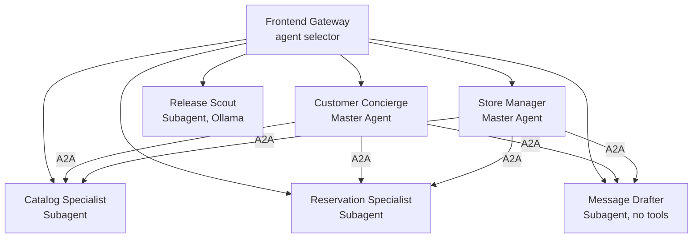
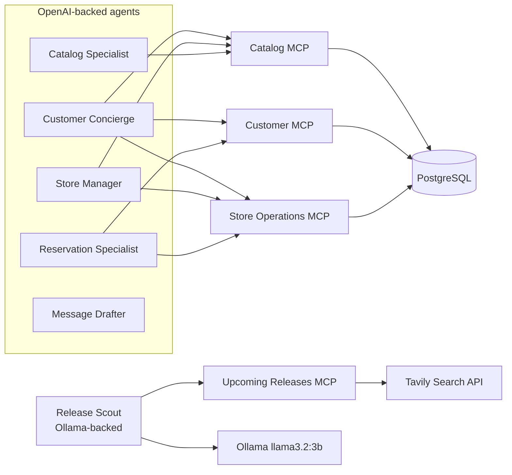
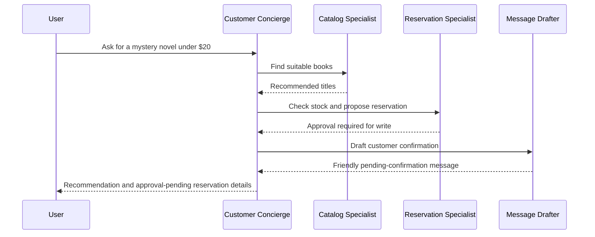
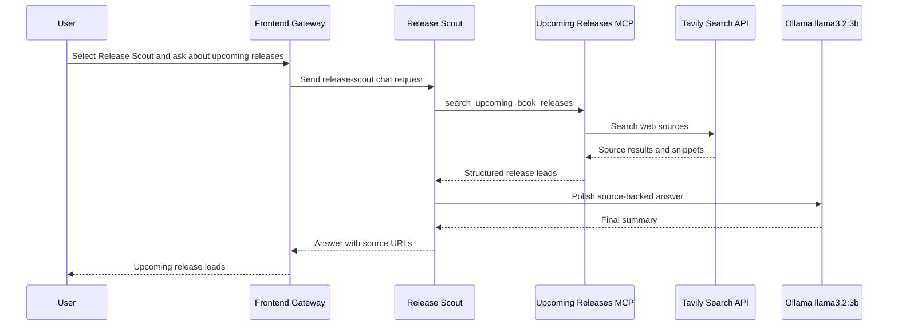
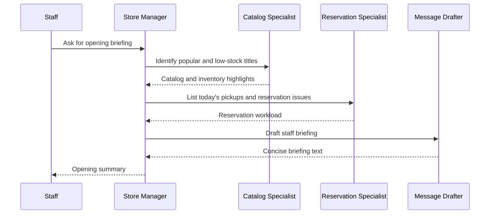
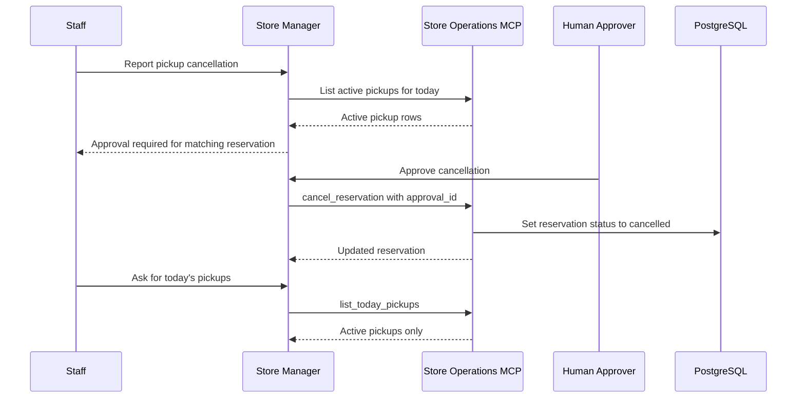

# Local Bookstore Assistant Scenario

## Overview

This scenario describes a small bookstore assistant platform made of six independently callable agents. The agents focus only on bookstore workflows: customer discovery, book reservations, store operations, message drafting, and upcoming release scouting.

The platform demonstrates:

- Six agents total
- Four subagents and two master agents
- Every agent callable independently
- MCP tool connectivity for most agents
- One subagent with no tools
- One Ollama-backed subagent for internet-backed release scouting
- Master-to-subagent A2A communication
- Database-backed read and write workflows

## MCP Server Split

Use four MCP servers. This keeps the demo simple while still showing clear capability boundaries.

| MCP server | Owns | Why this split works |
|---|---|---|
| Catalog MCP | Books, authors, categories, recommendations | Mostly read-heavy discovery and search behavior. |
| Store Operations MCP | Inventory, reservations, sales | Operational workflows often need joins across stock, reservations, and sales. |
| Customer MCP | Customers, loyalty status, preferences | Keeps customer data isolated from product and store operations. |
| Upcoming Releases MCP | Internet search for upcoming releases | Keeps external Tavily-backed web search separate from internal bookstore data. |

## Agents

| Agent | Type | Independently callable? | MCP tools | What it does |
|---|---:|---:|---|---|
| Customer Concierge | Master agent | Yes | Catalog MCP, Store Operations MCP, Customer MCP | Helps customers find books, checks availability, prepares reservations for approval, and produces customer-facing answers. |
| Store Manager | Master agent | Yes | Catalog MCP, Store Operations MCP | Gives staff daily summaries, flags low stock, reviews sales, highlights pickup workload, and prepares pickup status updates for approval. |
| Catalog Specialist | Subagent | Yes | Catalog MCP | Searches and recommends books based on genre, budget, author, age range, mood, popularity, or availability constraints. |
| Reservation Specialist | Subagent | Yes | Store Operations MCP, Customer MCP | Creates, updates, cancels, and reviews reservations through approval-gated write flows; checks whether a customer has existing pickups or loyalty benefits. |
| Message Drafter | Subagent | Yes | No tools | Turns supplied context into polished customer messages, staff briefings, pickup confirmations, or apology notes. |
| Release Scout | Subagent | Yes | Upcoming Releases MCP | Searches for upcoming book releases by theme, genre, or author, then uses local Ollama `llama3.2:3b` to summarize source-backed leads. |

## Agent Descriptions

### Customer Concierge

The Customer Concierge is a master agent for customer-facing interactions. It receives natural-language requests from shoppers, gathers the right information through tools and subagents, and returns a helpful final answer.

Typical responsibilities:

- Understand customer intent and constraints
- Ask the Catalog Specialist for book recommendations
- Ask the Reservation Specialist to check availability or create reservations
- Ask the Message Drafter to polish customer-facing responses
- Use customer information when loyalty status or preferences are relevant

Example request:

> I need a mystery novel for my dad, ideally under $20, and I want to pick it up today.

### Store Manager

The Store Manager is a master agent for staff-facing operations. It helps employees understand what needs attention before opening, during the day, or before closing.

Typical responsibilities:

- Summarize daily sales and reservation activity
- Identify low-stock or high-demand books
- Review pickup workload for the day
- Prepare customer-reported pickup cancellations or completions for approval
- Ask the Catalog Specialist for popular or low-stock titles
- Ask the Reservation Specialist for reservation status
- Ask the Message Drafter to prepare staff briefings

Example request:

> What should I pay attention to before opening today?

### Catalog Specialist

The Catalog Specialist is a subagent focused on book discovery. It can also be called directly when the user only needs search, filtering, or recommendation behavior.

Typical responsibilities:

- Search the catalog by title, author, genre, audience, or price
- Recommend books using customer constraints
- Explain why specific books match a request
- Provide structured candidate lists for master agents

Example request:

> Find three science fiction books under $25 that are good for a first-time reader.

### Reservation Specialist

The Reservation Specialist is a subagent focused on reservation workflows. It can be called directly for booking, canceling, updating, or reviewing reservations.

Typical responsibilities:

- Check whether a requested book is available
- Create pickup reservations
- Cancel existing reservations
- Mark reservations as picked up
- Review reservations for a customer or for the current day
- Use customer information when reservation context requires it
- Pause write operations until a human approves the proposed change

Example request:

> Reserve Project Hail Mary for Maria Chen for pickup this afternoon.

### Message Drafter

The Message Drafter is a no-tool subagent. It never connects directly to MCP servers or databases. Instead, it receives context from a caller and turns it into clear human-facing text.

Typical responsibilities:

- Draft customer pickup confirmations
- Draft reservation cancellation notes
- Draft short staff briefings
- Draft polite apology messages when a requested item is unavailable
- Rewrite operational facts in a friendlier tone

Example request:

> Turn these reservation details into a friendly pickup confirmation.

### Release Scout

The Release Scout is an independently callable subagent for upcoming releases. It
does not change existing recommendations, reservations, or store operations. It
uses the Upcoming Releases MCP server for Tavily-backed internet search and uses
Ollama `llama3.2:3b` for final source-backed answers.

Typical responsibilities:

- Search for upcoming releases by theme, genre, or author
- Surface source URLs and preorder or publisher evidence
- Distinguish confirmed dates from weaker release leads
- Return useful leads without mutating bookstore data

Example request:

> Find upcoming cozy fantasy releases.

## A2A Topology

## Runtime And Tool Topology

## Example Customer Reservation Flow

A customer asks:

> Can you find a mystery novel under $20 for my dad and reserve it for pickup today?

## Example Release Scout Flow

A shopper asks:

> What new books by Stephen King are coming soon?

## Example Staff Briefing Flow

A staff member asks:

> What should I pay attention to before opening today?

## Write Actions To Demonstrate

Write actions are approval-gated. During a normal agent run, the agent proposes
the write and emits an approval request; PostgreSQL is mutated only after a
human approves the request through the frontend or gateway API.

| Action | Agent likely responsible | MCP tool |
|---|---|---|
| Create pickup reservation | Reservation Specialist | `create_reservation` |
| Cancel reservation | Reservation Specialist | `cancel_reservation` |
| Update reservation status to picked up | Reservation Specialist or Store Manager | `mark_reservation_picked_up` |
| Adjust stock after manual sale or restock | Store Manager | `adjust_inventory` |
| Add customer preference | Customer Concierge or Reservation Specialist | `update_customer_preferences` |

## Candidate MCP Tools

| MCP server | Tool | Purpose |
|---|---|---|
| Catalog MCP | `search_books` | Search by title, author, genre, price, or audience. |
| Catalog MCP | `get_book_details` | Retrieve structured metadata for a single book. |
| Catalog MCP | `recommend_books` | Return book recommendations for a set of constraints. |
| Store Operations MCP | `check_stock` | Check availability for one or more books. |
| Store Operations MCP | `list_low_stock` | Identify books below a configured inventory threshold. |
| Store Operations MCP | `create_reservation` | Reserve available stock for customer pickup. |
| Store Operations MCP | `cancel_reservation` | Cancel an active reservation. |
| Store Operations MCP | `mark_reservation_picked_up` | Mark a reservation as fulfilled. |
| Store Operations MCP | `adjust_inventory` | Apply a manual stock correction or restock event. |
| Store Operations MCP | `list_today_pickups` | List active reservations scheduled for pickup today. |
| Store Operations MCP | `daily_sales_summary` | Summarize sales for a given date. |
| Store Operations MCP | `top_selling_books` | Return best-selling titles for a time period. |
| Customer MCP | `get_customer` | Retrieve customer profile details. |
| Customer MCP | `lookup_loyalty_status` | Check loyalty tier or benefits. |
| Customer MCP | `update_customer_preferences` | Add or update customer reading preferences. |
| Upcoming Releases MCP | `search_upcoming_book_releases` | Search the web for upcoming releases by author, theme, or genre. |

## Example Pickup Cancellation Flow

A staff member says:

> Theo Martin called and is not going to pick up Signal from Glass Moon. Can we update the system accordingly?

